----
----
# _RAK12014 Laser TOF sensor coming soon_
----
----

# WisBlock Watertank Level Sensor

|  |  |  |    
| :-: | :-: | :-: |     

Watertank Overflow detection using the **RAKwireless WisBlock** modules. It implements as well a trick to wake up the device from sleep by knocking on the enclosure. 

## _REMARK_
The code is based on my low power event driven [WisBlock API](https://github.com/beegee-tokyo/WisBlock-API) :arrow_heading_up:

----

# Background
Here in the Philippines it is essential to have a water tank, because it is (unfortunately) still quite common that the water supply is cut off.    
After I got my tank installed, I experienced several time that the floating valve that controls the refill of the tank got stuck and the tank was overflowing for hours before I detected it.    
As there is no outlet close to the water tank, I needed a low power, solar recharged overflow sensor that can transmit the data over a longer distance.     

**RAKWireless WisBlock** has all components I needed to build my overflow sensor.    
- **RAK19003 & RAK4631** ==> The base board, battery supply, solar charger, MCU with LPWAN capability
- **RAK12014** ==> WisBlock Laser ToF sensor to measure the water level
- **RAK1904** ==> Acceleration sensor. This is not used for the overflow detection, it is used to wake up the system and activate the BLE. As the system is sleeping most of the time the BLE is of course switched off to save battery. I needed a solution to wake up the MCU and activate the BLE, so that I can access the device and setup its parameters. To wake up the system, you knock-knock on the enclosure. This vibrations are detected by the acceleration sensor, which generates an interrupt to wake up the system.
- **Solar Board** => A small 5V solar panel to recharge the battery during the day.

The enclosure is not IP65 but can protect the electronics from water intrusion unless the device is submerged into the water. It was designed using Fusion 360. The data files for the enclosure and the small solar panel can be found in the [./assets/3D](./assets/3D) folder.

| 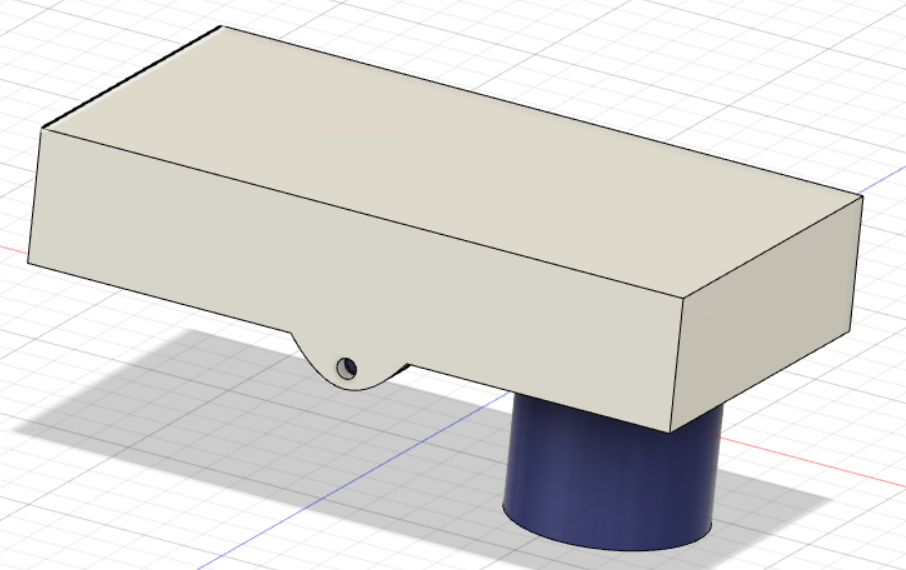 | 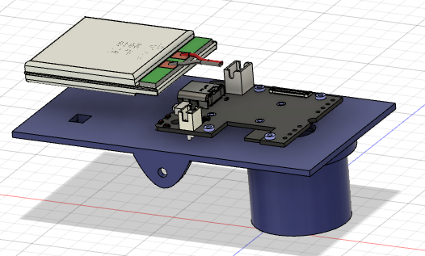 | 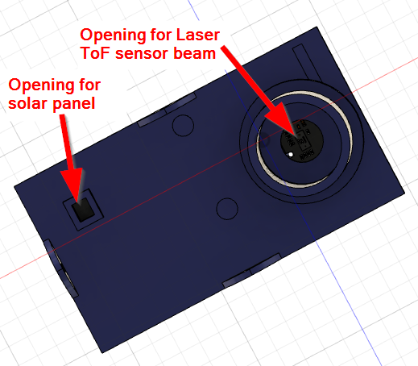 |    
| :-: | :-: | :-: |

# Dataflow
The sensor wakes up every 1 minute (configurable) and measures the distance between the Laser ToF sensor and the water surface. It packs the data into a data packet in [Cayenne LPP format](https://community.mydevices.com/t/cayenne-lpp-2-0/7510) :arrow_heading_up: which includes:    
- Alarm status Overflow (digital output). Triggered when the distance between the water surface and the sensor is 20mm or less.    
- Alarm status Low Level (digital output). Triggered when the distance between the water surface and the sensor is 1000mm or more.    
- Measured distance to water level (analog output). It is not the calculated water level, just the value read from the Laser ToF sensor. For my water tank the distance between the sensor and the bottom is around 1200mm. If the measured distance is larger than that, the value is discarded. The reason that such values are measured is because the water surface is not an ideal surface for measurement with the Laser ToF. Waves, sprinkling water while refilling can lead to false values.      
- The battery level of the system (analog output) in volt.

The data format is
```c++
uint8_t data_flag0 = 0x01; // 1 Channel # 1
uint8_t data_flag1 = 0x02; // 2 Analog Input
uint8_t level_1 = 0;	   // 3 Water level
uint8_t level_2 = 0;	   // 4 Water level
uint8_t data_flag2 = 0x02; // 5 Channel # 2
uint8_t data_flag3 = 0x02; // 6 Analog Input
uint8_t batt_1 = 0;	   // 7 Battery level
uint8_t batt_2 = 0;	   // 8 Battery level
uint8_t data_flag4 = 0x03; // 9 Channel # 3
uint8_t data_flag5 = 0x66; // 10 Presence sensor (Alarm)
uint8_t alarm_of = 0;	   // 11 Alarm flag overflow
uint8_t data_flag6 = 0x04; // 12 Channel # 4
uint8_t data_flag7 = 0x66; // 13 Presence sensor (Alarm)
uint8_t alarm_ll = 0;	   // 14 Alarm flag low level
```

The data is sent as a LPWAN packet over a [RAK7258 gateway](https://docs.rakwireless.com/Product-Categories/WisGate/RAK7258/Overview) :arrow_heading_up: to a local Chirpstack LPWAN server.    
The Chirpstack LPWAN server has two integrations enabled:
- Datacake. Instructions can be found in [Chirpstack to Datacake tutorial](https://news.rakwireless.com/how-to-visualize-your-sensor-data-on-datacake-using-chirpstack-server/) :arrow_heading_up:
- Cayenne LPP MyDevices    

Once Chirpstack has received a data packet for the Overflow sensor, it forwards the data to the two integrations.    

## Datacake
I used Datacake because it is a very comfortable tool to visualize the data:      

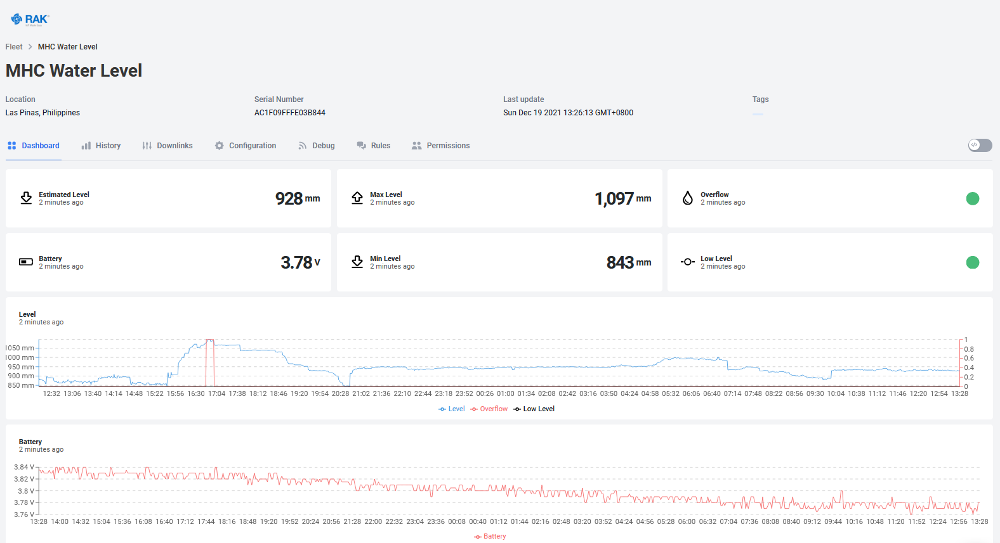    

In Datacake you can setup _**rules**_ that can send out on email on events. I use it to send an email if the Alarm value is true:

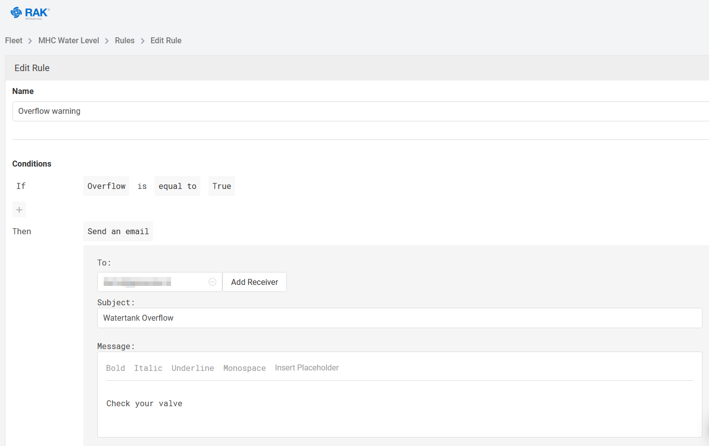

## Cayenne LPP MyDevices
And I added Cayenne LPP MyDevices, because it has more features to take actions on events by using _**triggers**_.

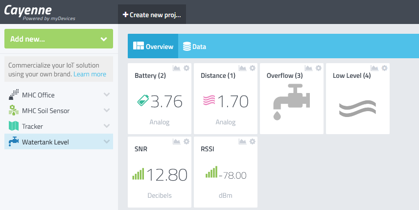    

The data **`Overflow`** is connected to a Cayenne LPP MyDevices _**trigger**_ that sends an email and a text message if the overflow sensor sends an alarm:    

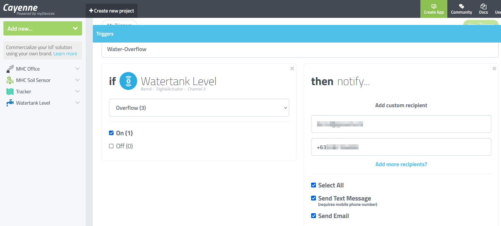    

The received alarm messages:

| 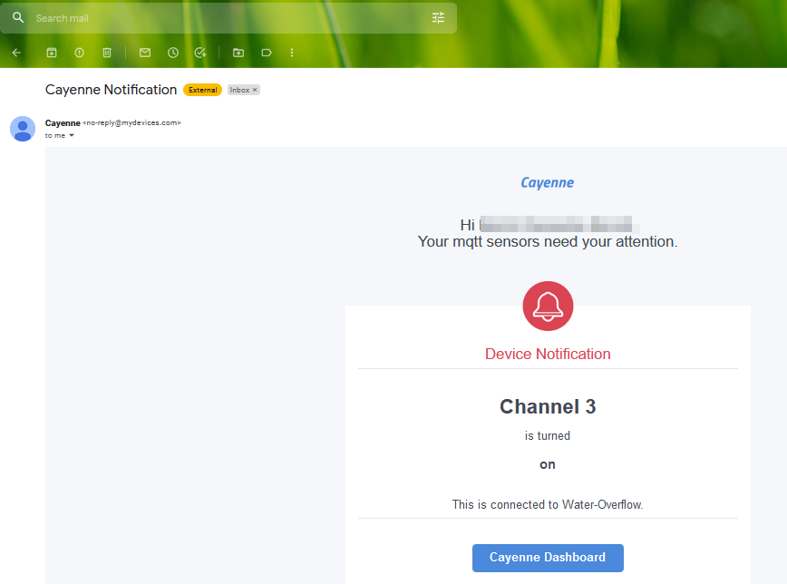 |  |    
| :-: | :-: | 

----

# Power supply and assembly of the sensor
The sensor uses a small 400mAh battery, which is sufficient for this application, as the sensor is only 10 seconds active every 1 minute.     
The battery is recharged during the day by a solar panel. The panel I used is 5V output panel, so that I can directly connect it to the WisBlock Base board.

|  | 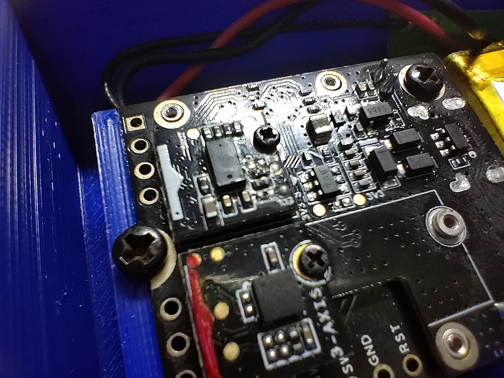 | 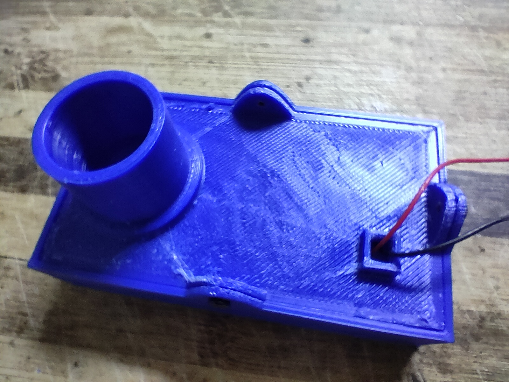 |     
| :-: | :-: | :-: |

----

# Installation  
The sensor is installed in an unused refill hole of the watertank. The 3D printed enclosure has a pipe that matches the diameter of the refill opening:

|  |  |    
| :-: | :-: | 

The sensor is just loose in the refill opening and the solar panel is placed on top of the water tank:

|  | 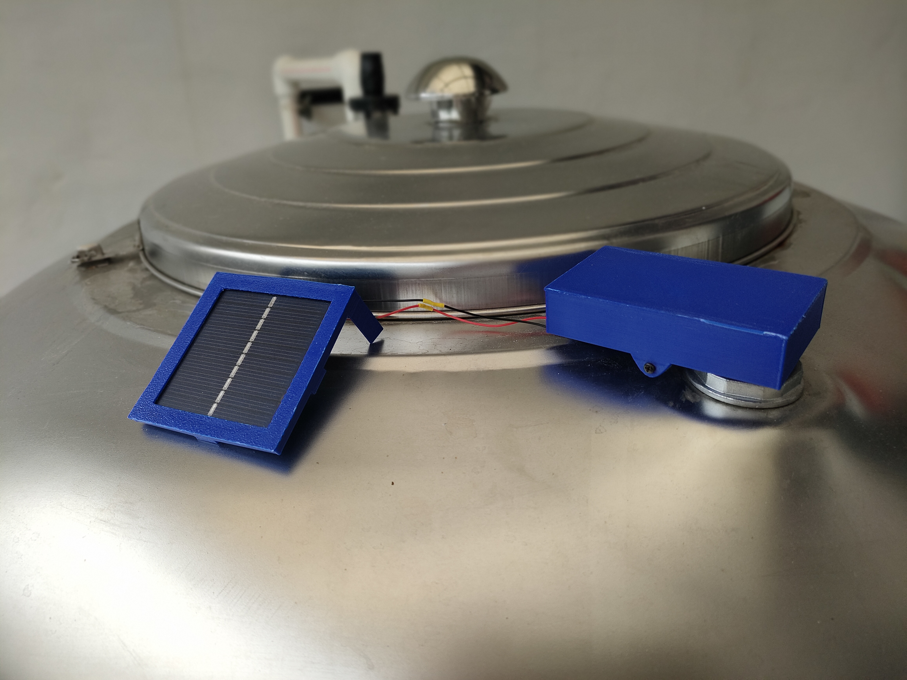 |    
| :-: | :-: | 

To protect the inside of the enclosure against condensing water from the tank the opening at the Laser ToF sensor is sealed with a peace of plastic glued to the enclosure:    

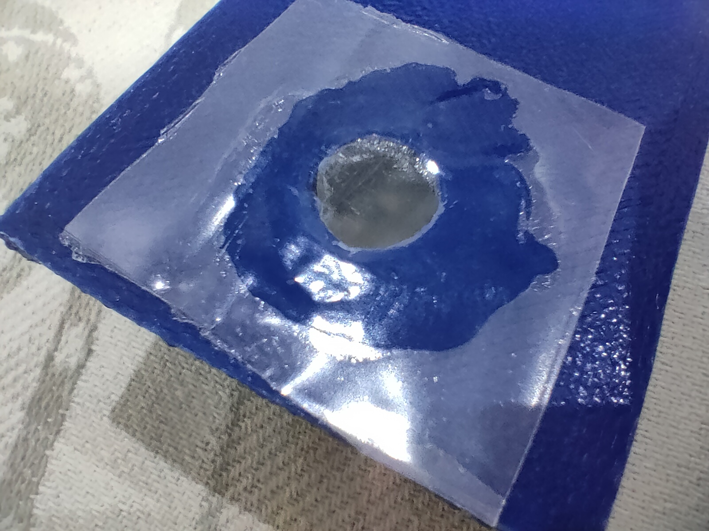


----

# How to wake up the sensor
To lower battery consumption, the device advertise its services (LPWAN setup and BLE UART) only for 30 seconds after power up. After that the BLE advertisement is shut off.    
But sometimes the BLE connection is required to change settings, update the firmware over BLE or debug over BLE UART.
To avoid opening the device or do a power cycle to restart the BLE advertising, I added the RAK1904 accelerometer and set it up so that it triggers an interrupt if it detects a movement in any direction. If the interrupt is triggered, the device wakes up and enables the BLE advertising for 15 seconds, so that the WisBlock Toolbox can connect to it.

To trigger the interrupt, a simple knock-knock on the enclosure is sufficient to be detected by the accelerometer.

----

# Hardware used
- [RAK4631](https://docs.rakwireless.com/Product-Categories/WisBlock/RAK4631/Overview/) :arrow_heading_up: WisBlock Core module
- [RAK19003](https://docs.rakwireless.com/Product-Categories/WisBlock/RAK19003/Overview/) :arrow_heading_up: WisBlock Base board
- [RAK12014](https://docs.rakwireless.com/Product-Categories/WisBlock/RAK12017/Overview/) :arrow_heading_up: WisBlock Laser ToF sensor
- [RAK1904](https://docs.rakwireless.com/Product-Categories/WisBlock/RAK1904/Overview) :arrow_heading_up: WisBlock Acceleration sensor
- [Solar Board](https://store.rakwireless.com/products/solar-board-1?_pos=1&_sid=cbf51f193&_ss=r) :arrow_heading_up: RAKWireless solar panel    

## Power consumption
The application does switch off the Laser ToF module and the MCU and LoRa transceiver go into sleep mode between measurement cycles to save power. I could measure a sleep current of 20-40uA of the whole system. 

----

# Software used
- [PlatformIO](https://platformio.org/install) :arrow_heading_up:
- [Adafruit nRF52 BSP](https://docs.platformio.org/en/latest/boards/nordicnrf52/adafruit_feather_nrf52832.html) :arrow_heading_up:
- [Patch to use RAK4631 with PlatformIO](https://github.com/RAKWireless/WisBlock/blob/master/PlatformIO/RAK4630/README.md) :arrow_heading_up:
- [SX126x-Arduino LoRaWAN library](https://github.com/beegee-tokyo/SX126x-Arduino) :arrow_heading_up:
- [WisBlock-API](https://platformio.org/lib/show/12807/WisBlock-API) :arrow_heading_up:
- [SparkFun LIS3DH Arduino Library](https://platformio.org/lib/show/1401/SparkFun%20LIS3DH%20Arduino%20Library) :arrow_heading_up:
- [Pololu VL53L0X Library](https://platformio.org/lib/show//854/VL53L0X) :arrow_heading_up:

## _REMARK_
The libraries are all listed in the **`platformio.ini`** and are automatically installed when the project is compiled.

----

# Setting up LoRaWAN credentials
The LoRaWAN settings can be defined in three different ways. 
- Over BLE with [WisBlock Toolbox](https://play.google.com/store/apps/details?id=tk.giesecke.wisblock_toolbox) :arrow_heading_up:
- Over USB with [AT Commands](https://github.com/beegee-tokyo/WisBlock-API/blob/main/AT-Commands.md) :arrow_heading_up:
- Hardcoded in the sources (_**ABSOLUTELY NOT RECOMMENDED**_)

## 1) Setup over BLE
Using the [WisBlock Toolbox](https://play.google.com/store/apps/details?id=tk.giesecke.wisblock_toolbox) :arrow_heading_up: you can connect to the WisBlock over BLE and setup all LoRaWAN parameters like
- Region
- OTAA/ABP
- Confirmed/Unconfirmed message
- ...

More details can be found in the [WisBlock Toolbox](https://github.com/beegee-tokyo/WisBlock-Toolbox#readme) :arrow_heading_up:

The device is advertising over BLE only the first 30 seconds after power up and then again for 15 seconds after wakeup for measurements. The device is advertising as **`MHC-WL-xx`** where xx is the BLE MAC address of the device.

## 2) Setup over USB port
Using the AT command interface the WisBlock can be setup over the USB port.

A detailed manual for the AT commands are in [AT-Commands.md](https://github.com/beegee-tokyo/WisBlock-API/blob/main/AT-Commands.md) :arrow_heading_up:

Here is an example for the typical AT commands required to get the device ready (EUI's and Keys are examples):
```log
// Setup AppEUI
AT+APPEUI=70b3d57ed00201e1
// Setup DevEUI
AT+DEVEUI=ac1f09fffe03efdc
// Setup AppKey
AT+APPKEY=2b84e0b09b68e5cb42176fe753dcee79
// Set automatic send frequency in seconds
AT+SENDFREQ=60
// Set data rate
AT+DR=3
// Set LoRaWAN region (here US915)
AT+BAND=8
// Reset node to save the new parameters
ATZ
// After reboot, start join request
AT+JOIN=1,1,8,10
```

## _REMARK_
The AT command format used here is compatible (with a few small differences) with the new RAKWireless AT command standard used in the RAK3172.

## 3) Hardcoded LoRaWAN settings
`void api_set_credentials(void);`
This informs the API that hard coded LoRaWAN credentials will be used. If credentials are sent over USB or from My nRF Toolbox, the received credentials will be ignored. _**It is strongly suggest NOT TO USE hard coded credentials to avoid duplicate node definitions**_    
If hard coded LoRaWAN credentials are used, they must be set before this function is called. Example:    
```c++
g_lorawan_settings.auto_join = false;							// Flag if node joins automatically after reboot
g_lorawan_settings.otaa_enabled = true;							// Flag for OTAA or ABP
memcpy(g_lorawan_settings.node_device_eui, node_device_eui, 8); // OTAA Device EUI MSB
memcpy(g_lorawan_settings.node_app_eui, node_app_eui, 8);		// OTAA Application EUI MSB
memcpy(g_lorawan_settings.node_app_key, node_app_key, 16);		// OTAA Application Key MSB
memcpy(g_lorawan_settings.node_nws_key, node_nws_key, 16);		// ABP Network Session Key MSB
memcpy(g_lorawan_settings.node_apps_key, node_apps_key, 16);	// ABP Application Session key MSB
g_lorawan_settings.node_dev_addr = 0x26021FB4;					// ABP Device Address MSB
g_lorawan_settings.send_repeat_time = 120000;					// Send repeat time in milliseconds: 2 * 60 * 1000 => 2 minutes
g_lorawan_settings.adr_enabled = false;							// Flag for ADR on or off
g_lorawan_settings.public_network = true;						// Flag for public or private network
g_lorawan_settings.duty_cycle_enabled = false;					// Flag to enable duty cycle (validity depends on Region)
g_lorawan_settings.join_trials = 5;								// Number of join retries
g_lorawan_settings.tx_power = 0;								// TX power 0 .. 15 (validity depends on Region)
g_lorawan_settings.data_rate = 3;								// Data rate 0 .. 15 (validity depends on Region)
g_lorawan_settings.lora_class = 0;								// LoRaWAN class 0: A, 2: C, 1: B is not supported
g_lorawan_settings.subband_channels = 1;						// Subband channel selection 1 .. 9
g_lorawan_settings.app_port = 2;								// Data port to send data
g_lorawan_settings.confirmed_msg_enabled = LMH_UNCONFIRMED_MSG; // Flag to enable confirmed messages
g_lorawan_settings.resetRequest = true;							// Command from BLE to reset device
g_lorawan_settings.lora_region = LORAMAC_REGION_AS923_3;		// LoRa region
// Inform API about hard coded LoRaWAN settings
api_set_credentials();
```

_**REMARK!**_    
Hard coded credentials must be set in `void setup_app(void)`!

----

# Packet data format
The packet data is in Cayenne LPP format. Every time the sensor data are collected, they are stored in a structure that is build in a format that most LPWAN servers and Integrations can easily parse. See [Dataflow](#dataflow) for details of the packet data format.

----

# Compiled output
The compiled files are located in the [./Generated](./Generated) folder. Each successful compiled version is named as      
**`WisBlock_WL_Vx.y.z_YYYY.MM.dd.hh.mm.ss`**    
x.y.z is the version number. The version number is setup in the [./platformio.ini](./platformio.ini) file.    
YYYY.MM.dd.hh.mm.ss is the timestamp of the compilation.

The generated **`.zip`** file can be used as well to update the device over BLE using either [My nRF52 Toolbox repo](https://github.com/beegee-tokyo/My-nRF52-Toolbox/blob/master/README.md) :arrow_heading_up: or [Nordic nRF Toolbox](https://play.google.com/store/apps/details?id=no.nordicsemi.android.nrftoolbox) :arrow_heading_up: or [nRF Connect](https://play.google.com/store/apps/details?id=no.nordicsemi.android.mcp) :arrow_heading_up:

----

# Debug options 
Debug output can be controlled by defines in the **`platformio.ini`**    
_**LIB_DEBUG**_ controls debug output of the SX126x-Arduino LoRaWAN library
 - 0 -> No debug outpuy
 - 1 -> Library debug output (not recommended, can have influence on timing)    

_**MY_DEBUG**_ controls debug output of the application itself
 - 0 -> No debug outpuy
 - 1 -> Application debug output

_**CFG_DEBUG**_ controls the debug output of the nRF52 BSP. It is recommended to keep it off

## Example for no debug output and maximum power savings:

```ini
[env:wiscore_rak4631]
platform = nordicnrf52
board = wiscore_rak4631
framework = arduino
build_flags = 
	; -DCFG_DEBUG=2
	-DSW_VERSION_1=1 ; major version increase on API change / not backwards compatible
	-DSW_VERSION_2=0 ; minor version increase on API change / backward compatible
	-DSW_VERSION_3=0 ; patch version increase on bugfix, no affect on API
	-DLIB_DEBUG=0    ; 0 Disable LoRaWAN debug output
	-DMY_DEBUG=0     ; 0 Disable application debug output
	-DNO_BLE_LED=1   ; 1 Disable blue LED as BLE notificator
lib_deps = 
	beegee-tokyo/SX126x-Arduino
	beegee-tokyo/WisBlock-API
	sparkfun/SparkFun LIS3DH Arduino Library
	pololu/VL53L0X
extra_scripts = pre:rename.py
```