# WisBlock Solution - Water Tank Level and Overflow Sensor

## Featuring WisBlock RAK12014 Laser ToF sensor

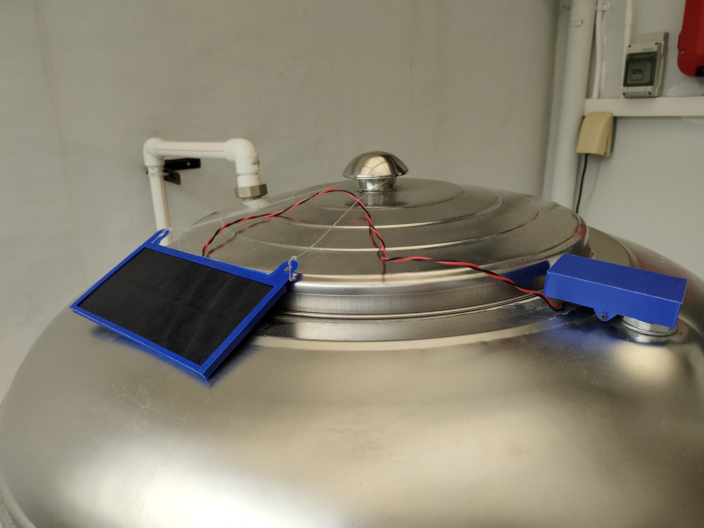

In many areas having a water tank is crucial, may it be in rural areas or in third world countries where a continuous  water supply is not guaranteed.       
Water tanks are quite simple constructions, you have the tank itself, the pipe going to your house and the refill pipe with a very basic floating ball valve.  
  
There are two critical situations that should trigger a notification or alarm:
- Low level of the water in the tank because of discontinued water supply    

- Water overflow because of malfunction of the floating ball valve    

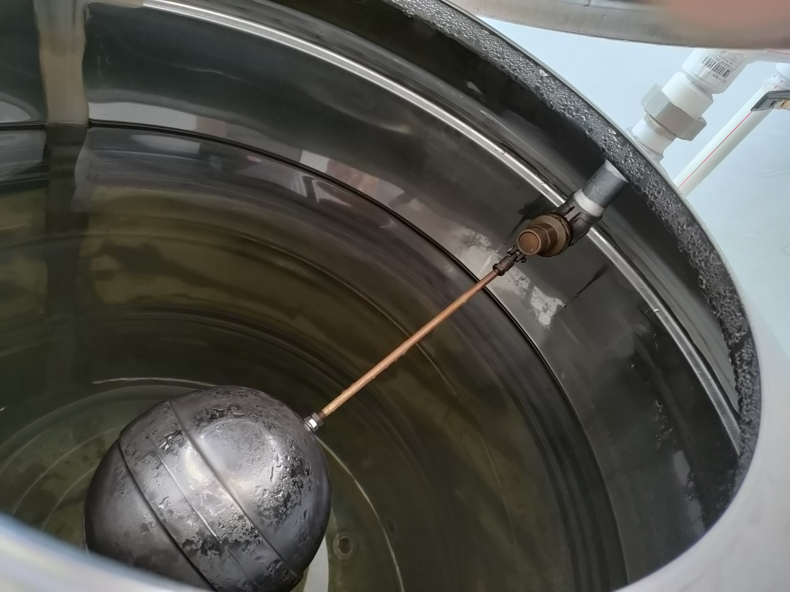

There are multiple options to detect these situations. Most of them require to submerge a sensor element in the water inside the tank. But such solutions can contaminate  the water in the tank, so another method to measure the water level is required.    

Two options for a contactless level measurement are using ultrasonic based sensors or ToF (time of flight) based sensors. As the openings in the tanks are quite small, a small sensor like the laser based ToF sensor is a good solution.

Other points to considerate are 
1) the power supply for the sensor
2) data transmission
3) status control and firmware update over the air without opening the sensor enclosure

For power supply a battery powered system is a good solution, as water tanks can be mounted on a high level, out of the reach of power outlets. To keep the sensor alive a small solar panel can be used to recharge the battery during day time.    

For data transmission, LoRaWAN is a perfect data transmission solution if the water tank is out of the range of WiFi or cellular signals.

And for the last part BLE is a good solution. It offers connection to the sensor without the need to connect to it with a cable. However, it will drain the battery, even if not in use.   
To get around the battery drain, an unusual idea came up. The BLE is switched off all the time. To enable BLE advertising, a 3-axis acceleration sensor inside the device is used as a virtual button. Knocking on the device enclosure sends vibration to the 3-axis sensor. These vibration trigger a motion interrupt from the acceleration sensor which then switches on the BLE advertising. This enables a BLE capable device (phone, tablet, laptop) to connect to the sensor and check or change the configuration or start an OTA DFU (over the air device firmware update).

Putting all above requirements together, the RAKWireless WisBlock modules are a perfect match to build a low power sensor system with a wide range communication capability. The WisBlock modules used in this proof-of-concept project are    

| | |
| --- | :-: |
| [**RAK19003 WisBlock Mini Base Board**](https://store.rakwireless.com/products/wisblock-base-board-rak19003) | 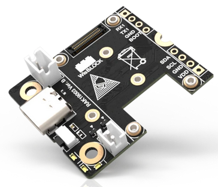 |
| [**RAK4631 WisBlock Core module with BLE and LoRa**](https://store.rakwireless.com/products/rak4631-lpwan-node) |  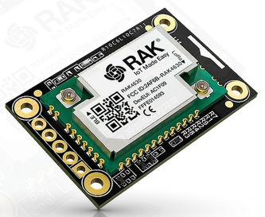 |
| [**RAK1904 WisBlock 3-axis acceleration sensor**](https://store.rakwireless.com/products/rak1904-lis3dh-3-axis-acceleration-sensor) |  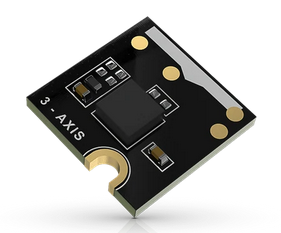 |
| [**RAK12014 WisBlock Laser ToF sensor**](https://store.rakwireless.com/products/rak12014-wisblock-tof-sensor) |  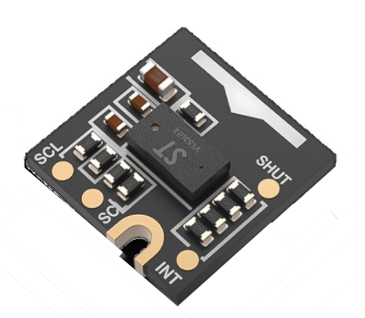 |

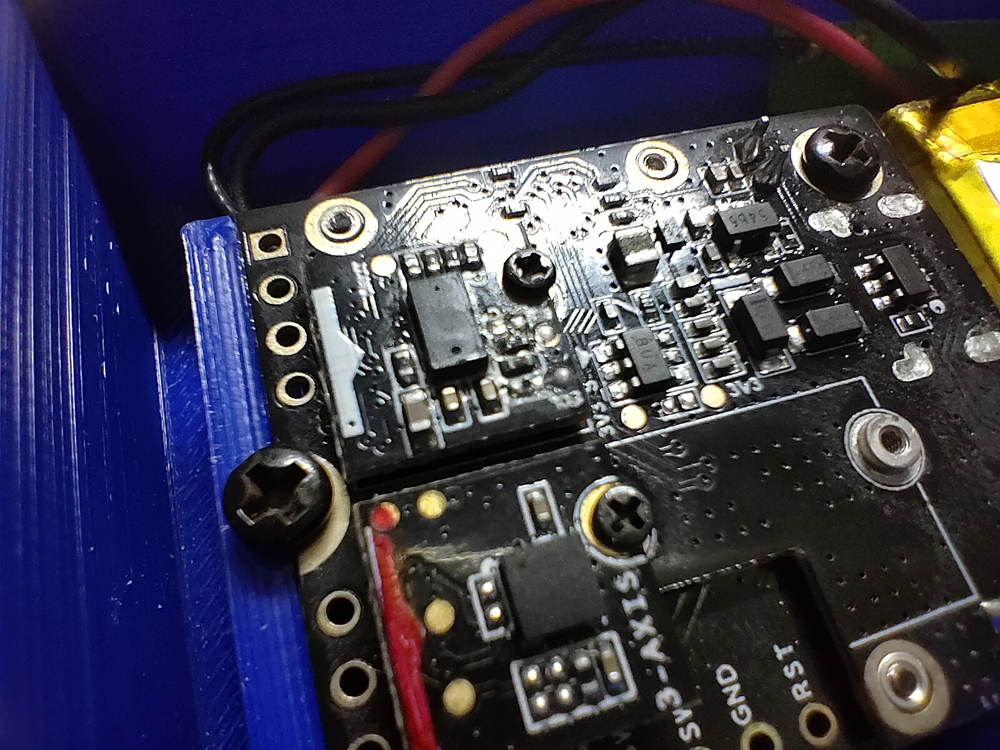

Using the WisBlock Mini Base Board makes it possible to design a small enclosure with only 83x47x19mm and still have space for a 400mAh battery inside. The small battery and the solar panel backup together with a deep-sleep current of only 30uA secures the uninterrupted function of the device even over rainy days.

The RAK4631 WisBlock Core module has the LoRa and BLE communication integrated and offers low consumption deep sleep mode.

The RAK1904 WisBlock Acceleration Sensor is used as the virtual switch to wake up the device for BLE communication.

And the RAK12014 Laser ToF sensor is the solution to have a contactless measurement of the water level inside the tank. It's range of 1.5m is sufficient for medium size tanks.

## The solution and some obstacles on the way

The hardware setup and mechanic design looked simple at first. However, some things came up during the design.  
  
The first one was how to deploy the sensor itself. The simplest solution was to make the sensor enclosure design to fit directly into a spare opening of the water tank. The enclosure shape includes a tube that fit's directly into opening of the water tank.

| | |
| --- | :-: |
|   |  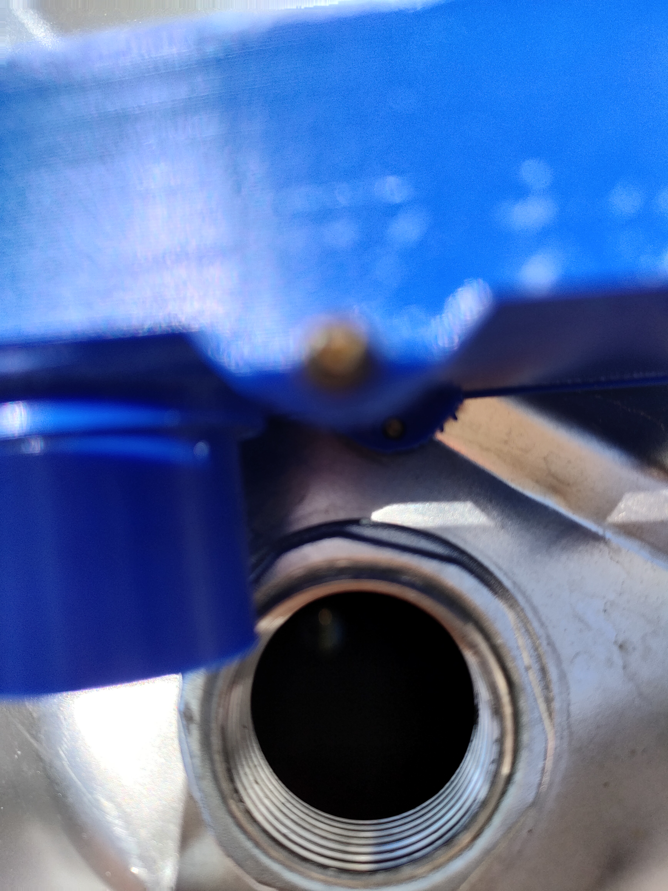 |

Here the first approach (shown in the images above) was to make the tube on the enclosure long to avoid it to wiggle. But that collided with the sensor specifications. Both the laser transmitting diode and the receiving diode have a characteristic for the distribution and the receiving beams. The first design with the long tube didn't match with these beams and the tube itself created reflections of the laser beam that led to wrong measurements.  

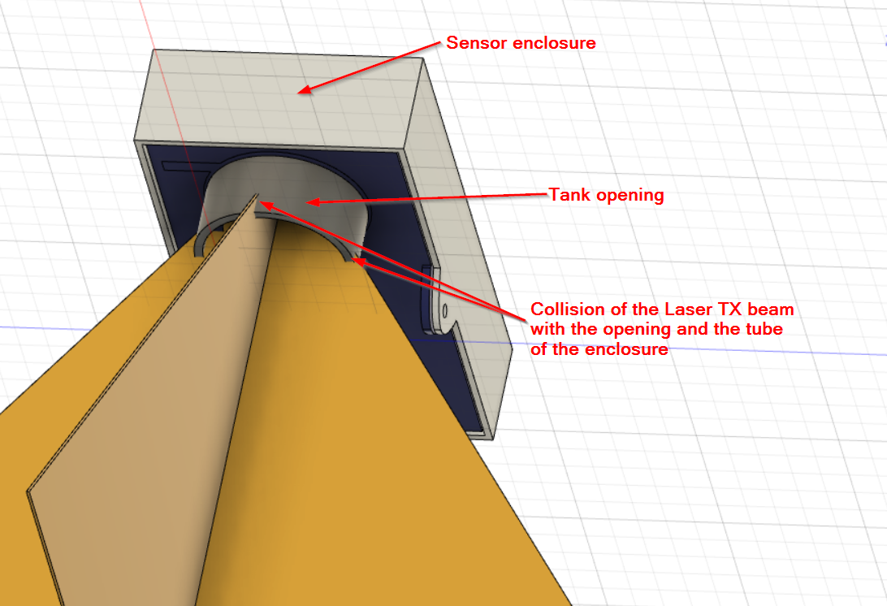

Changing the depth of the tube and placing the sensor lower in the enclosure fixed the problem.

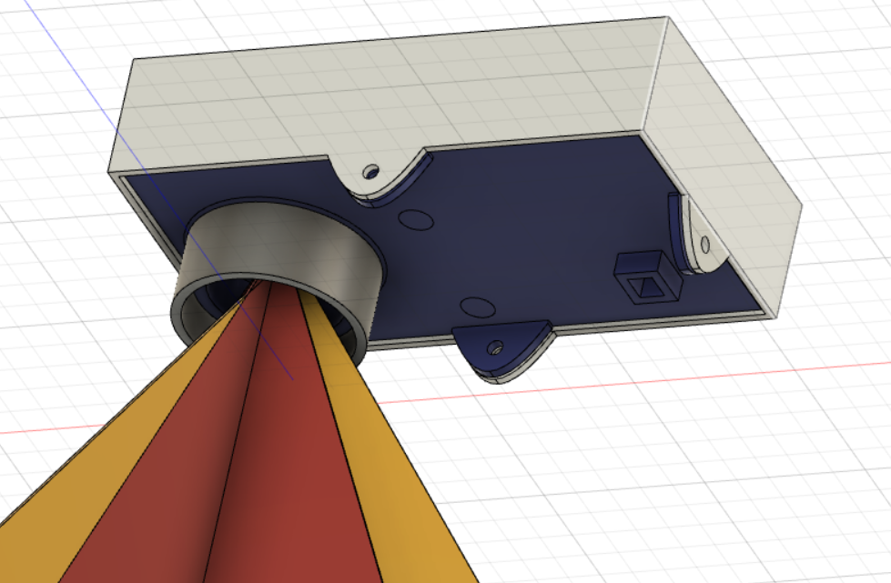

## Data transfer and visualization

The firmware of the sensor is measuring the water level every 1 minute and stays otherwise in deep sleep as long as possible. After measuring, the data is decoded in Cayenne LPP format, which makes it very easy to visualize it on different platforms like [Cayenne myDevices](https://mydevices.com/) or [Datacake](https://datacake.co/).

The data includes not only the water level itself, but as well the battery voltage and alarm flags for overflow and low water level detection. A detailed description of the data packet format can be found in the [firmware repo](https://github.com/beegee-tokyo/RAK4631-RAK12014-Waterlevel#dataflow).

The alarm flags for overflow and low level are calculated in the sensor itself. To do this thresholds are set in source code as well as estimated maximum depth of the water tank. The measured water level (depth of the tank - measured distance) is then compared to the thresholds and the alarm flags are set if the thresholds are higher.

The first step in the data transfer is the transmission of the data packet to a LoRaWAN gateway. The gateway will forward the packet to a LoRaWAN server like [TTN](https://www.thethingsnetwork.org) or [Chirpstack](https://www.chirpstack.io).    

Then applications in the LoRaWAN server application can be used to forward the data to visualization platforms. In the RAK News blog [How to Visualize Your Sensor Data on Datacake Using the Chirpstack Server](https://news.rakwireless.com/how-to-visualize-your-sensor-data-on-datacake-using-chirpstack-server/) is a tutorial how to implement the visualization with Chirpstack and Datacake.  
  
Here is an example of the visualization in Datacake:    

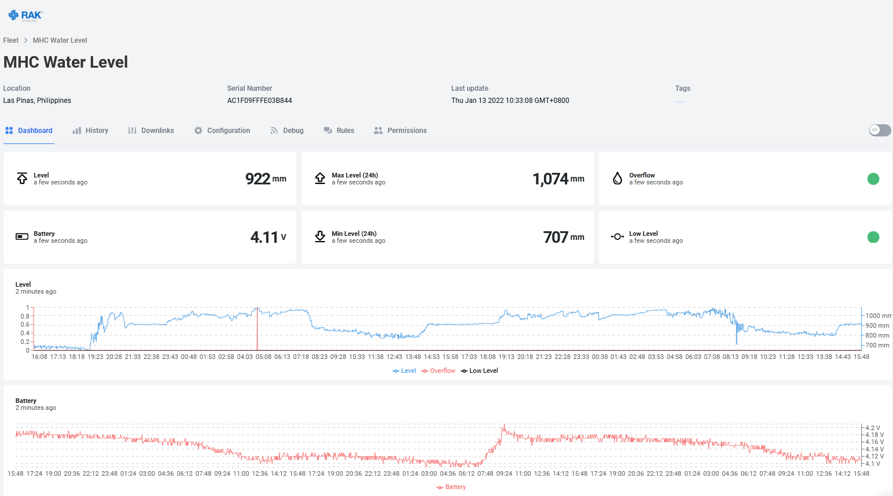

You can see as well the live data in this [Datacake Dashboard](https://app.datacake.de/dashboard/d/6a618495-9c10-4993-941e-96807b5db34f)

And here is the visualization in Cayenne myDevices:  

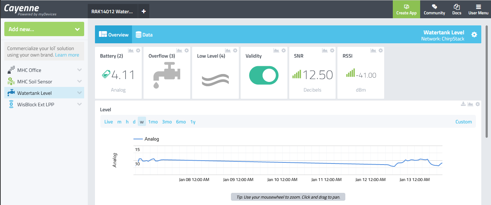

Both Datacake and Cayenne myDevices offer as well the option to send out an alarm as email or text message if an overflow alert or low level alert was issued.    
The setup is quite simple and the received alarms arrive in the email box or message box of the phone:

| Email alert | 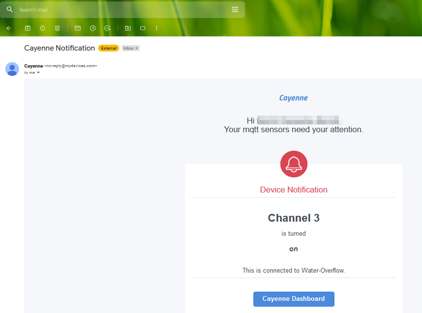 |
| -- | :-: |
| Text message | 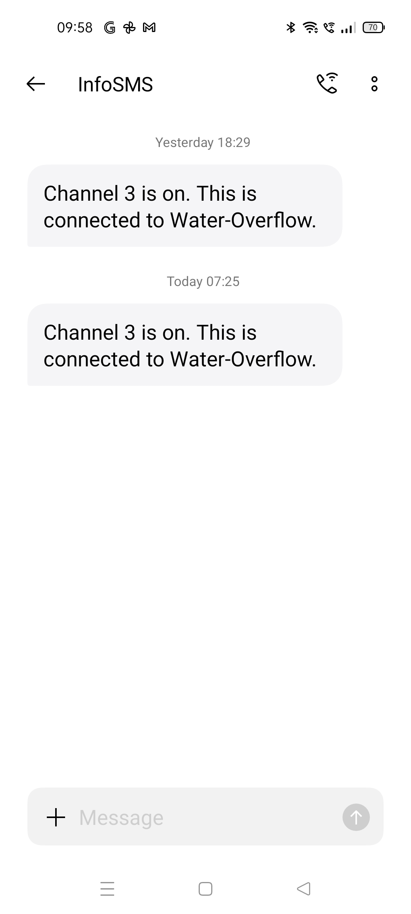 |

## More details
A more technical description of the project together with the source codes and the enclosure designs can be found in the [Github RAK4631-RAK12014-Waterlevel repo](https://github.com/beegee-tokyo/RAK4631-RAK12014-Waterlevel)

